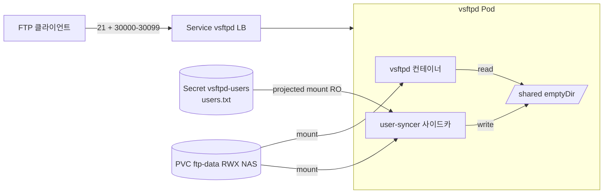

# 아키텍처

vsftpd 단일 Pod 가 어떤 책임을 가지고, NAS PVC / Secret / LoadBalancer 와 어떻게 묶이는지 운영자 관점에서 정리한다. 이미지 수정 / 매니페스트 수정 전에 의존 관계를 한 번 잡고 들어간다.

## 컴포넌트 다이어그램

| 컴포넌트 | 역할 | 파일 |
|---|---|---|
| `Service vsftpd` | MetalLB `192.168.3.42` 에 21 + 30000–30099 노출 | `k8s/05-service.yaml` |
| vsftpd 컨테이너 | 21 listen, PASV LAN-IP 응답, virtual user 인증 | `docker/conf/vsftpd.conf`, `docker/entrypoint.sh` |
| user-syncer 사이드카 | `users.txt` inotify → `users.db` regen | `docker/user-syncer.sh` |
| `Secret vsftpd-users` | `users.txt` 평문 (user/pass 페어), 운영자가 직접 갱신 | `k8s/03-secret.yaml.example` |
| `PVC ftp-data` | 사용자별 chroot 디렉토리 보관, NAS RWX | `k8s/01-pvc.yaml` |
| `/shared` emptyDir | Pod 수명만큼 사는 `users.db` Berkeley DB 파일 위치 | Deployment volume |
| `/var/run/vsftpd` emptyDir | RO root 환경에서 vsftpd 로그 named pipe 위치 | Deployment volume |

## 데이터 흐름

### 1. 클라이언트 로그인 (control 채널)

- **신호**: 클라이언트 → `192.168.3.42:21` TCP SYN.
- **호출**: vsftpd 가 PAM `pam_userdb.so db=/shared/users` 로 인증 (Berkeley DB).
- **결과**: 성공 시 chroot 후 `/srv/ftp/<user>` 로 진입. `230 Login successful` 응답.

### 2. PASV 채널 열림 (data 채널)

- **신호**: 클라이언트 `PASV` 명령.
- **호출**: vsftpd 가 30000–30099 사이에서 빈 포트를 할당, 클라이언트에 `227 Entering Passive Mode (192,168,3,42,…)` 응답.
- **결과**: 클라이언트가 같은 LB IP 의 그 포트로 직접 연결. `externalTrafficPolicy: Local` 이라 같은 노드의 vsftpd Pod 로 라우팅된다.

### 3. 무중단 사용자 추가

- **신호**: `kubectl apply -f secret.yaml` 로 `vsftpd-users` 갱신.
- **호출**: kubelet 이 projected volume 의 `users.txt` 를 atomic 갱신 (`..data/` 심볼릭 링크 회전). user-syncer 의 inotify 가 `moved_to` 이벤트 감지 후 `sleep 1` 로 마운트 안정화 대기.
- **결과**: 줄 수 짝수성 / 사용자명 정규식 (`[a-zA-Z0-9_-]+`) 검증 통과 시 `users.db.new` 빌드 → `mv` 로 swap. vsftpd 는 매 로그인마다 DB 를 다시 열기 때문에 재기동 없이 신규 사용자 즉시 로그인 (관측 ~18초).

### 4. 사용자 디렉토리 자동 생성

- **신호**: user-syncer 가 새 사용자명을 발견.
- **호출**: `mkdir -p /srv/ftp/<user>` + `chown ftpvirt:ftpvirt`.
- **결과**: NAS PVC 위에 사용자별 chroot 루트 생성. 기존 사용자는 skip.

## 장애 / 동시성 모델

- **단일 Pod, strategy=Recreate.** replicaCount=1. vsftpd 가 multi-pod safe 하지 않다 — 같은 사용자가 두 Pod 에 분산되면 PASV 포트 풀 충돌. **PASV 포트 풀이 Pod 단위 자원이라 수평 확장 자체가 의미 없다.**
- **상태의 소스는 NAS PVC + Secret.** vsftpd Pod 자체는 무상태. Pod 가 죽으면 다른 노드에서 PVC 재마운트 후 부팅 (관측 31초 drain + reschedule).
- **`users.db` 는 Pod 수명용 캐시.** Pod 재기동 시 entrypoint 가 Secret `users.txt` 에서 다시 빌드한다. `/shared` 가 emptyDir 여도 안전하다.
- **`max_per_ip=10`, `max_clients=600`.** 한 source IP 의 11번째 동시 세션 또는 클러스터-와이드 601번째 세션이 거부된다. 동시 500세션 부하 검증은 통과 (관측: peak 502, CPU 249m / Mem 316Mi).

## 의도적으로 하지 않은 것

- **TLS / SFTP.** 사내망 전용 + 사외 차단 전제. 외부 노출 시점에 별도 설계가 필요하다.
- **메트릭 exporter.** 1.0 운영 안정화 후 도입으로 결정 — 현재는 xferlog stdout 으로만 관측. [모니터링#알려진-한계](../operating/monitoring.md#알려진-한계) 참고.
- **Calico EgressGateway 로 source IP 고정.** 클러스터가 Flannel CNI 이므로 Phase 4 스킵. 외부 시스템이 vsftpd outbound source IP 화이트리스트를 요구하면 Phase 4 재개.
- **HA / 다중 Pod.** PASV 포트 풀 충돌로 의미 없음 (위 장애 모델 참고).
- **사용자별 quota.** 현재 PVC 전체 크기만 제한. 사용자별 quota 가 필요해지면 별도 디렉토리 quota 도구 (XFS project quota 등) 도입.
