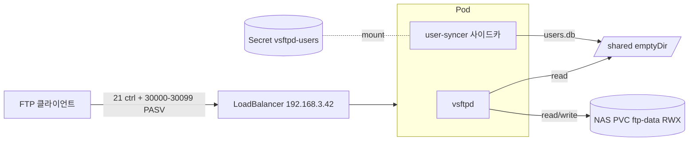

# k8s-ftp

**Talos K8s 위에 vsftpd 단일 Pod + NAS PVC + 가상 사용자로 돌리는 사내망 Plain FTP 서비스.**
PASV 포트 100개를 LoadBalancer 로 노출하고, Secret 변경 한 번으로 사용자 추가/제거가 끝나도록 user-syncer 사이드카로 자동 동기화한다.

➡️ [아키텍처](concepts/architecture.md) · [트러블슈팅](operating/troubleshooting.md)

## 무엇을 해결하나

- **외부에서 PASV 가 끊긴다** — PASV 30000–30099 포트를 LoadBalancer Service 로 통째로 노출, `pasv_address=<LB IP>` 가 클라이언트에 그대로 전달돼 사내 LAN 안에서는 NAT/방화벽 추가 작업 없이 PASV 가 닿는다.
- **사용자 추가하려면 Pod 를 재기동해야 한다** — user-syncer 사이드카가 `users.txt` 변경을 inotify 로 감지해 `users.db` 를 atomic rename 으로 교체. vsftpd 는 매 로그인마다 DB 를 다시 열기 때문에 재기동 없이 신규 사용자 즉시 로그인 가능 (관측 ~18초).
- **데이터가 단일 노드에 묶인다** — `ftp-data` PVC 가 `ReadWriteMany` (NAS) 라 노드 drain 시 다른 worker 로 재배치되어도 동일 디렉토리 트리를 마운트한다.

## 누가 쓰나

| 역할 | 설명 | 시작 페이지 |
|---|---|---|
| **운영자** | vsftpd Pod 점검, 사용자 추가/제거, 일상 운영 | [→ 사용자 관리](operating/user-management.md) |
| **On-call** | 사고 발생 시 증상별 대응 매트릭스 진입 | [→ 트러블슈팅](operating/troubleshooting.md) |
| **컨트리뷰터** | 이미지 / 매니페스트 / vsftpd.conf 수정 | [→ 아키텍처](concepts/architecture.md) |

## 핵심 개념 한눈에

상세 흐름은 [개념 — 아키텍처](concepts/architecture.md), 일상 운영 절차는 [운영](operating/index.md) 섹션의 페이지들이 정본.

## 다음 단계

- 처음이라면: [개념 개요](concepts/index.md) 에서 시스템 모델 파악.
- 사고가 났다면: [트러블슈팅](operating/troubleshooting.md) 의 증상 매트릭스 진입.
- 메트릭/로그 식별: [모니터링](operating/monitoring.md).
- 설치 / 배포 / 운영 SOP: [README](https://github.com/nineking424/k8s-ftp#k8s-배포).
