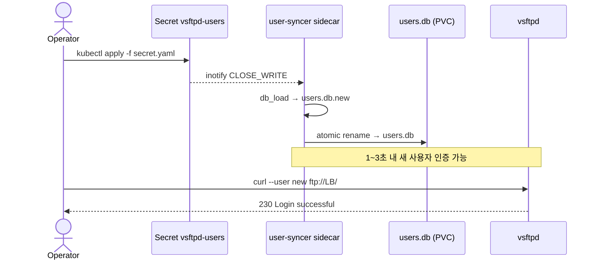

# 사용자 관리

가상 사용자 추가/제거 절차. 변경의 source of truth 는 `vsftpd-users` Secret 이고, user-syncer sidecar 가 atomic rename 으로 `users.db` 를 갱신한다.

## 변경 흐름



반영 타이밍은 1~3 초. user-syncer 가 검증 실패를 감지하면 기존 `users.db` 를 그대로 유지하므로 *실패해도 기존 사용자는 영향 없음*.

## 검증 룰

| 항목 | 규칙 | 위반 시 |
|---|---|---|
| 줄 구조 | 홀수 라인 = 사용자명, 짝수 라인 = 비밀번호 | `ERROR: ... 줄 수가 짝수가 아님` → 기존 DB 유지 |
| 사용자명 정규식 | `^[a-zA-Z0-9_-]+$` | `ERROR: 잘못된 사용자명` → 기존 DB 유지 |
| 인코딩 | UTF-8, BOM 없음 | `db_load` 실패 → 기존 DB 유지 |
| 최대 사용자 수 | 실측 한계 미정 (메모리 제약) | — |

## 사용자 추가

`alice` 사용자를 신규 추가하는 end-to-end 예시.

1. 현재 Secret 디코드 — 임시 파일은 작업 후 즉시 삭제.

```bash
kubectl get secret vsftpd-users -n ftp -o jsonpath='{.data.users\.txt}' | base64 -d > /tmp/users.txt
```

2. 사용자명 + 비밀번호 두 줄 추가. 한 사용자당 정확히 두 라인.

```bash
{
  echo "alice"
  echo "alice_password_strong_random"
} >> /tmp/users.txt
```

3. Secret 재생성 — `kubectl create secret --dry-run -o yaml | kubectl apply -f -` 패턴으로 atomic 교체.

```bash
kubectl create secret generic vsftpd-users \
  --from-file=users.txt=/tmp/users.txt \
  -n ftp \
  --dry-run=client -o yaml | kubectl apply -f -
rm /tmp/users.txt
```

4. user-syncer 로그에 동기화 완료 라인이 1~3 초 안에 등장.

```bash
kubectl logs -n ftp -l app=vsftpd -c user-syncer --tail=10 | grep "INFO: users.db 동기화 완료"
```

5. 신규 사용자 로그인 검증.

```bash
curl --user 'alice:alice_password_strong_random' "ftp://192.168.3.42/" 2>&1 | grep "230"
```

## 사용자 제거

`alice` 사용자를 제거하는 절차. 데이터 디렉토리 `/srv/ftp/alice/` 는 자동 삭제되지 않으므로 별도 백업·정리.

1. 현재 Secret 디코드.

```bash
kubectl get secret vsftpd-users -n ftp -o jsonpath='{.data.users\.txt}' | base64 -d > /tmp/users.txt
```

2. `alice` 의 두 줄 (사용자명 + 비밀번호) 제거 — 직접 편집하거나 `sed` 로.

```bash
sed -i '/^alice$/,+1d' /tmp/users.txt
```

> macOS BSD `sed` 은 `-i ''` 가 필요하고 `,+N` 주소 문법 미지원. macOS 라면 `vi /tmp/users.txt` 로 직접 편집 권장.

3. Secret 재생성.

```bash
kubectl create secret generic vsftpd-users \
  --from-file=users.txt=/tmp/users.txt \
  -n ftp \
  --dry-run=client -o yaml | kubectl apply -f -
rm /tmp/users.txt
```

4. user-syncer 로그에 동기화 완료 확인 (위와 동일).
5. 제거된 사용자의 로그인이 실패해야 함.

```bash
curl --user 'alice:alice_password_strong_random' "ftp://192.168.3.42/" 2>&1 | grep "530"
```

기존 세션이 살아 있던 경우 vsftpd 가 즉시 끊지는 않는다 — 다음 control 채널 명령에서 인증 다시 확인 시 끊김. 강제 종료가 필요하면 `kubectl rollout restart deployment/vsftpd -n ftp` 로 전체 세션 리셋 (다른 사용자도 끊김 — 운영 영향 고려).

## 변경 후 검증

세 항목 모두 확인.

| 항목 | 검증 | 통과 기준 |
|---|---|---|
| 신규 로그인 | `curl --user 'new:pw' ftp://192.168.3.42/` | `230 Login successful` |
| 제거된 사용자 | `curl --user 'old:pw' ftp://192.168.3.42/` | `530 Login incorrect` |
| user-syncer 동기화 | `kubectl logs -n ftp -l app=vsftpd -c user-syncer --tail=10` | `INFO: users.db 동기화 완료` 라인의 timestamp 가 apply 이후 |

## 실패 시

| 증상 | 후속 |
|---|---|
| user-syncer 로그가 `ERROR: 잘못된 사용자명` | [트러블슈팅 — 무중단 사용자 추가가 반영되지 않는다](troubleshooting.md#무중단-사용자-추가가-반영되지-않는다) |
| user-syncer 로그가 `ERROR: ... 줄 수가 짝수가 아님` | 동상 |
| Pod 가 CrashLoop, `db_load: ...` 라인 | [트러블슈팅 — Pod 가 CrashLoop](troubleshooting.md#pod-가-crashloop) |

## 알려진 한계

- **사용자명 정규식이 ASCII only.** 한글·공백·`@`·`.` 등 사용 불가 — `[a-zA-Z0-9_-]+`.
- **사용자별 quota 없음.** vsftpd 가 사용자별 디스크 사용량 제한을 강제하지 않는다. NAS PVC 전체 용량이 모든 사용자에게 공유.
- **비밀번호 회전 미자동화.** 정기 회전이 정책이라면 운영자가 같은 절차로 수동 처리.
- **데이터 디렉토리 자동 정리 없음.** 사용자 제거 시 `/srv/ftp/<user>/` 가 남아 새 사용자가 동일 이름으로 들어오면 기존 데이터에 접근하게 된다 — 이름 재사용 정책 별도 합의.
