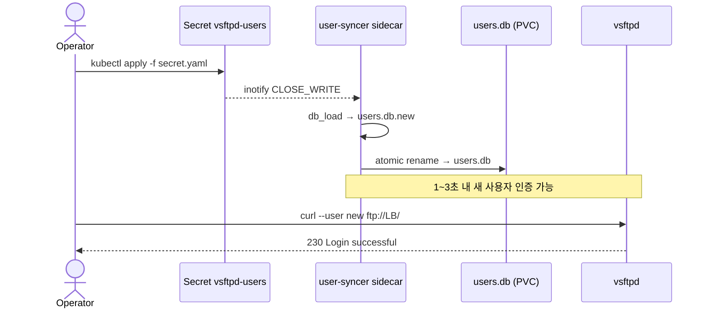

# 사용자 관리

가상 사용자 추가/제거 절차. 변경의 source of truth 는 `vsftpd-users` Secret 이고, user-syncer sidecar 가 atomic rename 으로 `users.db` 를 갱신한다.

## 변경 흐름

반영 타이밍은 1~3 초. user-syncer 가 검증 실패를 감지하면 기존 `users.db` 를 그대로 유지하므로 *실패해도 기존 사용자는 영향 없음*.

## 검증 룰

| 항목 | 규칙 | 위반 시 |
|---|---|---|
| 줄 구조 | 홀수 라인 = 사용자명, 짝수 라인 = 비밀번호 | `ERROR: ... 줄 수가 짝수가 아님` → 기존 DB 유지 |
| 사용자명 정규식 | `^[a-zA-Z0-9_-]+$` | `ERROR: 잘못된 사용자명` → 기존 DB 유지 |
| 인코딩 | UTF-8, BOM 없음 | `db_load` 실패 → 기존 DB 유지 |
| 최대 사용자 수 | 실측 한계 미정 (메모리 제약) | — |
