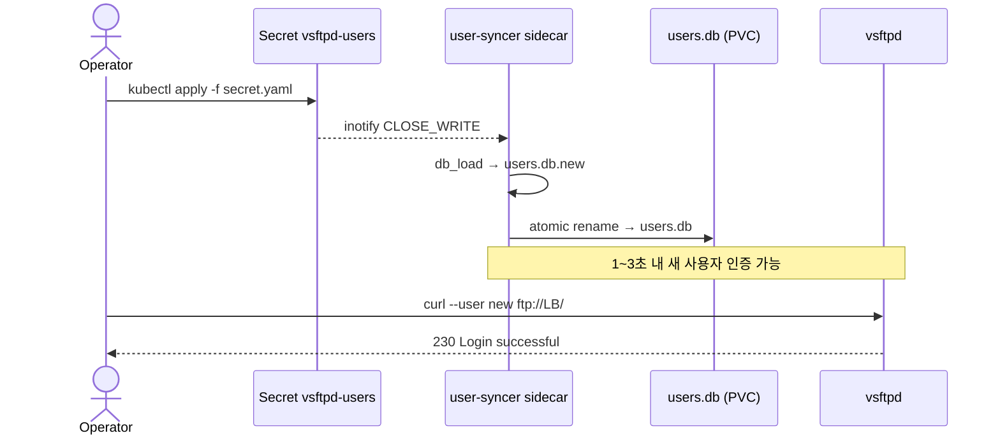

# Wiki 개선 Implementation Plan

> **For agentic workers:** REQUIRED SUB-SKILL: Use superpowers:subagent-driven-development (recommended) or superpowers:executing-plans to implement this plan task-by-task. Steps use checkbox (`- [ ]`) syntax for tracking.

**Goal:** Wiki 가 README#운영-sop 폴스루 없이 자급자족하도록 SSOT 를 wiki 로 이전하고, 사용자 추가·제거 정식 절차 페이지를 신설하며, broken-link CI 로 drift 를 차단한다.

**Architecture:** 2 PR 분할 — PR 1 은 CI 보강 + `user-management.md` 신설 + README 일부 축약, PR 2 는 `maintenance.md` 신설 + README 전체 표 전환 + `monitoring.md` placeholder 메타 보강. 각 PR 머지 전 `mkdocs build --strict` (내부 anchor) + `lychee --remap` (README → wiki 절대 URL) 양쪽 게이트 통과 필수.

**Tech Stack:** mkdocs 1.6.1, readthedocs theme, mkdocs-mermaid2-plugin 1.2.1, pymdown-extensions 10.11, lychee (GitHub Action `lycheeverse/lychee-action@v2`), GitHub Pages.

**Spec:** `docs/superpowers/specs/2026-05-12-wiki-improvement-design.md`

---

## 파일 구조

| 파일 | 동작 | 책임 |
|---|---|---|
| `.github/workflows/docs.yml` | 수정 | PR 트리거 + lychee link-check job + deploy 조건부 |
| `docs/operating/user-management.md` | 신설 (PR 1) | 가상 사용자 추가/제거 정식 절차 |
| `docs/operating/maintenance.md` | 신설 (PR 2) | PASV 포트 확장 / LB IP 변경 / 보안 패치 / 백업 |
| `docs/operating/monitoring.md` | 수정 (PR 2) | placeholder 메타 컬럼 추가 |
| `docs/operating/troubleshooting.md` | 수정 (PR 1, PR 2) | README 폴스루 anchor → wiki anchor |
| `docs/operating/index.md` | 수정 (PR 1, PR 2) | nav cross-link 추가 |
| `docs/index.md` | 수정 (PR 1) | 페르소나 라우팅 표 갱신 |
| `mkdocs.yml` | 수정 (PR 1, PR 2) | nav 두 줄 추가 |
| `README.md` | 수정 (PR 1, PR 2) | 운영 SOP → 운영 빠른 참조 표 |

---

## PR 1 (P0 + P1) — CI 보강 + 사용자 관리

머지 후 `https://nineking424.github.io/k8s-ftp/operating/user-management/` HTTP 200 검증.

### Task 1: Docs CI 에 PR 트리거 + lychee link-check 추가

**Files:**
- Modify: `.github/workflows/docs.yml` (전체 교체)

- [ ] **Step 1: 현재 워크플로 확인**

Run: `cat .github/workflows/docs.yml`
Expected: `on: push: branches: [main]` + `workflow_dispatch` 트리거, `build` 와 `deploy` 두 job.

- [ ] **Step 2: 새 워크플로 작성**

`.github/workflows/docs.yml` 을 다음 내용으로 교체:

```yaml
name: Deploy docs to GitHub Pages

on:
  push:
    branches: [main]
    paths:
      - 'docs/**'
      - 'mkdocs.yml'
      - 'requirements-docs.txt'
      - '.github/workflows/docs.yml'
      - 'README.md'
  pull_request:
    paths:
      - 'docs/**'
      - 'mkdocs.yml'
      - 'requirements-docs.txt'
      - '.github/workflows/docs.yml'
      - 'README.md'
  workflow_dispatch:

permissions:
  contents: read
  pages: write
  id-token: write

concurrency:
  group: pages
  cancel-in-progress: false

jobs:
  build:
    runs-on: ubuntu-latest
    steps:
      - uses: actions/checkout@v4

      - uses: actions/setup-python@v5
        with:
          python-version: '3.12'
          cache: pip
          cache-dependency-path: requirements-docs.txt

      - name: Install deps
        run: pip install -r requirements-docs.txt

      - name: Build (strict)
        run: mkdocs build --strict

      - uses: actions/upload-pages-artifact@v3
        with:
          path: site

      - uses: actions/upload-artifact@v4
        with:
          name: site-dir
          path: site/

  link-check:
    needs: build
    runs-on: ubuntu-latest
    steps:
      - uses: actions/checkout@v4

      - uses: actions/download-artifact@v4
        with:
          name: site-dir
          path: site/

      - name: lychee link check
        uses: lycheeverse/lychee-action@v2
        with:
          args: >-
            --no-progress
            --remap 'https://nineking424.github.io/k8s-ftp/(.*) file://${{ github.workspace }}/site/$1'
            --exclude-mail
            README.md docs/**/*.md
          fail: true

  deploy:
    needs: [build, link-check]
    if: github.event_name == 'push' && github.ref == 'refs/heads/main'
    runs-on: ubuntu-latest
    environment:
      name: github-pages
      url: ${{ steps.deployment.outputs.page_url }}
    steps:
      - id: deployment
        uses: actions/deploy-pages@v4
```

- [ ] **Step 3: YAML 문법 검증**

Run: `python -c "import yaml; yaml.safe_load(open('.github/workflows/docs.yml'))"`
Expected: 출력 없음 (성공).

- [ ] **Step 4: 커밋**

```bash
git add .github/workflows/docs.yml
git commit -m "ci(docs): PR 트리거와 lychee link-check 추가

- PR에서도 mkdocs build --strict + lychee 검증
- lychee --remap으로 wiki 절대 URL을 빌드된 site/로 치환해 머지 전 anchor 검증
- deploy job은 main push 조건부로 분리"
```

---

### Task 2: user-management.md — 변경 흐름 + 검증 룰

**Files:**
- Create: `docs/operating/user-management.md`

- [ ] **Step 1: 페이지 skeleton 작성 — 헤더 + 오프닝 + 변경 흐름 + 검증 룰**

`docs/operating/user-management.md` 신규 파일에 다음 내용 작성:

```markdown
# 사용자 관리

가상 사용자 추가/제거 절차. 변경의 source of truth 는 `vsftpd-users` Secret 이고, user-syncer sidecar 가 atomic rename 으로 `users.db` 를 갱신한다.

## 변경 흐름



반영 타이밍은 1~3 초. user-syncer 가 검증 실패를 감지하면 기존 `users.db` 를 그대로 유지하므로 *실패해도 기존 사용자는 영향 없음*.

## 검증 룰

| 항목 | 규칙 | 위반 시 |
|---|---|---|
| 줄 구조 | 홀수 라인 = 사용자명, 짝수 라인 = 비밀번호 | `ERROR: ... 줄 수가 짝수가 아님` → 기존 DB 유지 |
| 사용자명 정규식 | `^[a-zA-Z0-9_-]+$` | `ERROR: 잘못된 사용자명` → 기존 DB 유지 |
| 인코딩 | UTF-8, BOM 없음 | `db_load` 실패 → 기존 DB 유지 |
| 최대 사용자 수 | 실측 한계 미정 (메모리 제약) | — |
```

- [ ] **Step 2: 페이지 빌드 검증 — 자체적으로는 미완성이지만 mermaid/표 렌더 확인**

Run: `mkdocs build --strict 2>&1 | tail -20`
Expected: build 성공 (anchor warning 없음). 사이드바에 새 페이지가 아직 등장 안 함 (nav 미수정 — Task 4 에서 추가).

- [ ] **Step 3: 커밋**

```bash
git add docs/operating/user-management.md
git commit -m "docs: user-management.md 변경 흐름과 검증 룰 추가

vsftpd-users Secret → user-syncer → users.db atomic rename 시퀀스를 mermaid로,
사용자명 정규식·짝수 라인 규칙을 표로 명시. 실패 시 기존 DB 유지 동작 강조."
```

---

### Task 3: user-management.md — 추가/제거 절차 + 검증 + 실패 + 한계

**Files:**
- Modify: `docs/operating/user-management.md` (이전 task 의 페이지에 H2 섹션 4 개 추가)

- [ ] **Step 1: "사용자 추가" 절차 본문 추가**

`docs/operating/user-management.md` 파일 끝에 다음 추가:

````markdown

## 사용자 추가

`alice` 사용자를 신규 추가하는 end-to-end 예시.

1. 현재 Secret 디코드 — 임시 파일은 작업 후 즉시 삭제.

```bash
kubectl get secret vsftpd-users -n ftp -o jsonpath='{.data.users\.txt}' | base64 -d > /tmp/users.txt
```

2. 사용자명 + 비밀번호 두 줄 추가. 한 사용자당 정확히 두 라인.

```bash
{
  echo "alice"
  echo "alice_password_strong_random"
} >> /tmp/users.txt
```

3. Secret 재생성 — `kubectl create secret --dry-run -o yaml | kubectl apply -f -` 패턴으로 atomic 교체.

```bash
kubectl create secret generic vsftpd-users \
  --from-file=users.txt=/tmp/users.txt \
  -n ftp \
  --dry-run=client -o yaml | kubectl apply -f -
rm /tmp/users.txt
```

4. user-syncer 로그에 동기화 완료 라인이 1~3 초 안에 등장.

```bash
kubectl logs -n ftp -l app=vsftpd -c user-syncer --tail=10 | grep "INFO: users.db 동기화 완료"
```

5. 신규 사용자 로그인 검증.

```bash
curl --user 'alice:alice_password_strong_random' "ftp://192.168.3.42/" 2>&1 | grep "230"
```

## 사용자 제거

`alice` 사용자를 제거하는 절차. 데이터 디렉토리 `/srv/ftp/alice/` 는 자동 삭제되지 않으므로 별도 백업·정리.

1. 현재 Secret 디코드.

```bash
kubectl get secret vsftpd-users -n ftp -o jsonpath='{.data.users\.txt}' | base64 -d > /tmp/users.txt
```

2. `alice` 의 두 줄 (사용자명 + 비밀번호) 제거 — 직접 편집하거나 `sed` 로.

```bash
sed -i '/^alice$/,+1d' /tmp/users.txt
```

3. Secret 재생성.

```bash
kubectl create secret generic vsftpd-users \
  --from-file=users.txt=/tmp/users.txt \
  -n ftp \
  --dry-run=client -o yaml | kubectl apply -f -
rm /tmp/users.txt
```

4. user-syncer 로그에 동기화 완료 확인 (위와 동일).
5. 제거된 사용자의 로그인이 실패해야 함.

```bash
curl --user 'alice:alice_password_strong_random' "ftp://192.168.3.42/" 2>&1 | grep "530"
```

기존 세션이 살아 있던 경우 vsftpd 가 즉시 끊지는 않는다 — 다음 control 채널 명령에서 인증 다시 확인 시 끊김. 강제 종료가 필요하면 `kubectl rollout restart deployment/vsftpd -n ftp` 로 전체 세션 리셋 (다른 사용자도 끊김 — 운영 영향 고려).

## 변경 후 검증

세 항목 모두 확인.

| 항목 | 검증 | 통과 기준 |
|---|---|---|
| 신규 로그인 | `curl --user 'new:pw' ftp://192.168.3.42/` | `230 Login successful` |
| 제거된 사용자 | `curl --user 'old:pw' ftp://192.168.3.42/` | `530 Login incorrect` |
| user-syncer 동기화 | `kubectl logs -n ftp -l app=vsftpd -c user-syncer --tail=10` | `INFO: users.db 동기화 완료` 라인의 timestamp 가 apply 이후 |

## 실패 시

| 증상 | 후속 |
|---|---|
| user-syncer 로그가 `ERROR: 잘못된 사용자명` | [트러블슈팅 — 무중단 사용자 추가가 반영되지 않는다](troubleshooting.md#무중단-사용자-추가가-반영되지-않는다) |
| user-syncer 로그가 `ERROR: ... 줄 수가 짝수가 아님` | 동상 |
| Pod 가 CrashLoop, `db_load: ...` 라인 | [트러블슈팅 — Pod 가 CrashLoop](troubleshooting.md#pod-가-crashloop) |

## 알려진 한계

- **사용자명 정규식이 ASCII only.** 한글·공백·`@`·`.` 등 사용 불가 — `[a-zA-Z0-9_-]+`.
- **사용자별 quota 없음.** vsftpd 가 사용자별 디스크 사용량 제한을 강제하지 않는다. NAS PVC 전체 용량이 모든 사용자에게 공유.
- **비밀번호 회전 미자동화.** 정기 회전이 정책이라면 운영자가 같은 절차로 수동 처리.
- **데이터 디렉토리 자동 정리 없음.** 사용자 제거 시 `/srv/ftp/<user>/` 가 남아 새 사용자가 동일 이름으로 들어오면 기존 데이터에 접근하게 된다 — 이름 재사용 정책 별도 합의.
````

- [ ] **Step 2: 빌드 + 내부 cross-link 검증**

Run: `mkdocs build --strict 2>&1 | grep -E "WARNING|ERROR" || echo OK`
Expected: `OK`. `troubleshooting.md` 의 `무중단-사용자-추가가-반영되지-않는다` 와 `pod-가-crashloop` anchor 가 실제로 존재함을 strict 빌드가 확인.

- [ ] **Step 3: 커밋**

```bash
git add docs/operating/user-management.md
git commit -m "docs(user-management): 추가/제거 end-to-end 절차와 검증 단계

신규 사용자 추가는 Secret 갱신 후 user-syncer INFO 라인 + curl 230 검증.
제거 시 기존 세션 처리·데이터 디렉토리 잔존 등 운영 주의점 명시.
실패 시 트러블슈팅 page 의 두 anchor로 폴스루."
```

---

### Task 4: nav 통합 — mkdocs.yml + operating/index + docs/index

**Files:**
- Modify: `mkdocs.yml:36-45`
- Modify: `docs/operating/index.md`
- Modify: `docs/index.md`

- [ ] **Step 1: mkdocs.yml nav 에 user-management 추가**

`mkdocs.yml` 의 `nav:` 섹션을 다음과 같이 수정 — `운영` 아래 `사용자 관리` 한 줄 추가 (모니터링 앞에 배치, 가장 빈도 높은 작업이 가장 위).

```yaml
nav:
  - 개요: index.md
  - 개념:
      - 개요: concepts/index.md
      - 아키텍처: concepts/architecture.md
  - 운영:
      - 개요: operating/index.md
      - 사용자 관리: operating/user-management.md
      - 모니터링: operating/monitoring.md
      - 트러블슈팅: operating/troubleshooting.md
```

- [ ] **Step 2: docs/operating/index.md 에 cross-link 추가**

현재 `docs/operating/index.md` 의 내용을 읽고, 페이지 카탈로그/링크 목록이 있다면 `사용자 관리 — user-management.md` 항목을 가장 앞 또는 빈도 순으로 추가. 형식은 기존 페이지 스타일을 그대로 따른다.

Run: `cat docs/operating/index.md`

표/리스트가 있으면 거기에 한 행/한 항목 추가. 예시:

```markdown
- [사용자 관리](user-management.md) — 가상 사용자 추가·제거 정식 절차
- [모니터링](monitoring.md) — ...
- [트러블슈팅](troubleshooting.md) — ...
```

- [ ] **Step 3: docs/index.md 의 페르소나 라우팅에 사용자 관리 항목 추가**

`docs/index.md` 의 페르소나 라우팅 표 (운영자 / On-call / 컨트리뷰터 행) 에서 *운영자* 행의 "시작 페이지" 컬럼을 `operating/user-management.md` 로 갱신 (가장 빈도 높은 시나리오로 라우팅). 다른 행은 그대로.

Run: `cat docs/index.md`

표를 확인하고 *운영자* 행의 링크 셀을 `[사용자 관리](operating/user-management.md)` 로 수정.

- [ ] **Step 4: 빌드 + nav 출현 확인**

Run: `mkdocs build --strict 2>&1 | grep -E "WARNING|ERROR" || echo OK`
Expected: `OK`.

Run: `grep -E '사용자 관리' site/operating/user-management/index.html | head -3`
Expected: 사이드바에 새 페이지가 렌더링됨.

- [ ] **Step 5: 커밋**

```bash
git add mkdocs.yml docs/operating/index.md docs/index.md
git commit -m "docs(nav): user-management 페이지를 nav와 페르소나 라우팅에 추가

mkdocs nav의 운영 섹션 맨 위(빈도 순) + operating/index 카탈로그 +
docs/index 페르소나 표의 운영자 시작 페이지를 user-management로 라우팅."
```

---

### Task 5: README 사용자 추가/제거 섹션 축약

**Files:**
- Modify: `README.md:26-34`

- [ ] **Step 1: 현재 사용자 추가/제거 섹션 확인**

Run: `sed -n '24,35p' README.md`
Expected: `## 운영 SOP` + `### 사용자 추가` (4 단계) + `### 사용자 제거` (2 단계).

- [ ] **Step 2: 두 섹션 본문을 wiki 링크 + 한 줄 명령으로 교체**

`README.md` 의 `### 사용자 추가` 와 `### 사용자 제거` 두 섹션 본문을 다음으로 교체. *섹션 헤더 (`### 사용자 추가`, `### 사용자 제거`) 는 유지*, 본문만 짧게.

```markdown
### 사용자 추가
한 줄 요약: `kubectl create secret generic vsftpd-users --from-file=users.txt=/tmp/users.txt -n ftp --dry-run=client -o yaml | kubectl apply -f -`

자세한 절차: [user-management.md — 사용자 추가](https://nineking424.github.io/k8s-ftp/operating/user-management/#사용자-추가)

### 사용자 제거
동일 메커니즘으로 Secret 에서 두 줄 (사용자명+비밀번호) 제거. 데이터 디렉토리 `/srv/ftp/<user>/` 는 별도 백업 후 정리.

자세한 절차: [user-management.md — 사용자 제거](https://nineking424.github.io/k8s-ftp/operating/user-management/#사용자-제거)
```

다른 SOP 섹션 (`### PASV 포트 사용률 확인` 부터 `### 백업` 까지) 은 *그대로 두고 손대지 않음* — PR 2 에서 처리.

- [ ] **Step 3: 빌드 + lychee 로컬 검증**

Run: `mkdocs build --strict 2>&1 | grep -E "WARNING|ERROR" || echo OK`
Expected: `OK`.

Run (lychee 가 로컬에 설치돼 있다면):
```bash
lychee --no-progress \
  --remap "https://nineking424.github.io/k8s-ftp/(.*) file://$(pwd)/site/\$1" \
  README.md 2>&1 | tail -5
```
Expected: `0 Errors` — README 의 새 wiki 절대 URL 두 개가 빌드된 site/ 안의 `operating/user-management/` 페이지 + anchor 로 정상 매핑.

로컬에 lychee 가 없으면 이 단계는 PR 의 GitHub Actions 가 대신 검증 — skip 가능.

- [ ] **Step 4: 커밋**

```bash
git add README.md
git commit -m "docs(readme): 사용자 추가/제거 섹션을 wiki 링크로 축약

본문을 1~2줄로 줄이고 user-management.md anchor로 폴스루.
다른 SOP 섹션 (PASV/LB IP/보안 패치/백업)은 PR2에서 처리.
SSOT를 wiki로 점진 이전."
```

---

### Task 6: troubleshooting.md 의 `README#사용자-추가` anchor 갱신

**Files:**
- Modify: `docs/operating/troubleshooting.md` (사용자 추가 케이스의 "조치" 문장)

- [ ] **Step 1: 현재 anchor 위치 확인**

Run: `grep -n "README#사용자-추가\|README#운영-sop" docs/operating/troubleshooting.md`
Expected: 두 라인 — 사용자 추가 케이스의 조치 (`README#사용자-추가`) 와 별도 위치의 `README#운영-sop`. *이번 task 에선 `README#사용자-추가` 만 변경, `README#운영-sop` 는 PR 2 에서 처리.*

- [ ] **Step 2: `README#사용자-추가` anchor 를 wiki anchor 로 교체**

`docs/operating/troubleshooting.md` 의 "무중단 사용자 추가가 반영되지 않는다" 섹션의 조치 문장에서:

```
[README — 사용자 추가](https://github.com/nineking424/k8s-ftp#사용자-추가)
```

를 다음으로 변경:

```
[user-management.md — 사용자 추가](user-management.md#사용자-추가)
```

이때 외부 GitHub URL 이 아닌 wiki 내부 상대 경로로 — 같은 wiki 안의 cross-link 이므로 상대 경로가 정본.

- [ ] **Step 3: 빌드 + grep 검증**

Run: `mkdocs build --strict 2>&1 | grep -E "WARNING|ERROR" || echo OK`
Expected: `OK` (cross-anchor `user-management.md#사용자-추가` 가 실제로 존재함을 strict 가 확인).

Run: `grep -n "README#사용자-추가" docs/operating/troubleshooting.md || echo "0 hit"`
Expected: `0 hit`.

Run: `grep -n "README#운영-sop" docs/operating/troubleshooting.md | wc -l`
Expected: `1` (PR 2 에서 마저 처리할 잔여).

- [ ] **Step 4: 커밋 + PR 1 푸시**

```bash
git add docs/operating/troubleshooting.md
git commit -m "docs(troubleshooting): 사용자 추가 anchor를 wiki 내부로 갱신

README#사용자-추가 폴스루를 user-management.md#사용자-추가로 교체.
README#운영-sop 잔여 한 곳은 PR2에서 처리."

git push -u origin HEAD:wiki-improvement-p1
gh pr create --title "docs(wiki): SSOT 이전 P1 — CI 보강 + user-management 페이지" --body "$(cat <<'EOF'
## Summary
- CI: PR 트리거 + lychee link-check job 추가, deploy는 main push 조건부
- 신설: operating/user-management.md (변경 흐름 mermaid + 검증 룰 표 + 추가/제거 end-to-end + 실패 폴스루 + 한계)
- nav: mkdocs.yml / operating/index / docs/index 페르소나 표 갱신
- 축약: README 사용자 추가/제거 두 섹션을 wiki 링크로 (다른 SOP 섹션은 PR2)
- 갱신: troubleshooting.md의 README#사용자-추가 → user-management.md#사용자-추가

Spec: docs/superpowers/specs/2026-05-12-wiki-improvement-design.md

## Test Plan
- [ ] CI: mkdocs --strict 통과
- [ ] CI: lychee link-check 통과 (README의 wiki 절대 URL 2개 포함)
- [ ] 머지 후: https://nineking424.github.io/k8s-ftp/operating/user-management/ HTTP 200
- [ ] 머지 후: README 표의 wiki 절대 URL 두 개가 새 페이지의 anchor로 정상 도착
EOF
)"
```

---

## PR 2 (P2 + P3) — maintenance + 나머지 축약 + placeholder 보강

PR 1 머지가 main 에 반영된 다음 시작. 머지 후 `https://nineking424.github.io/k8s-ftp/operating/maintenance/` HTTP 200 검증.

### Task 7: maintenance.md skeleton + PASV 포트 범위 확장

**Files:**
- Create: `docs/operating/maintenance.md`

- [ ] **Step 1: 페이지 헤더 + 1줄 오프닝 + 첫 H2 (PASV 포트 확장)**

`docs/operating/maintenance.md` 신규 파일에 다음 작성:

```markdown
# 운영 절차 (Maintenance)

사용자 관리 외 정기·비정기 운영 절차. 각 H2 는 **사전 조건** → **단계** → **검증** → **알려진 한계** 4 구간.

사용자 추가·제거는 [user-management.md](user-management.md) — 빈도가 높아 별도 페이지.

## PASV 포트 범위 확장

`421 Too many connections` 또는 동시 세션 한계 도달이 일상화되면 PASV 포트 범위를 늘려 수용량을 확장한다. 기본은 30000–30099 (100 포트).

**사전 조건.**

- 현재 동시 세션 임계 도달이 일시적 폭주가 아닌 추세 — [monitoring.md — 자식 PID 카운트](monitoring.md#동시-세션과-pasv-사용률) 로 5 분 이상 480 + 지속 확인.
- 신규 NodePort 가 클러스터 다른 Service 와 충돌 없음 — `kubectl get svc -A | grep -E '3009[0-9]|301[0-9][0-9]'` 로 확인.

**단계.**

100 → 200 포트로 확장 (30000–30199) 예시.

1. `docker/conf/vsftpd.conf` 의 `pasv_max_port` 값을 `30199` 로 변경.

```bash
sed -i 's/^pasv_max_port=.*/pasv_max_port=30199/' docker/conf/vsftpd.conf
```

2. 이미지 재빌드 + 푸시 — 태그는 날짜 기반 (`vYYYYMMDD-1`).

```bash
docker build -t <registry>/vsftpd:v$(date +%Y%m%d)-1 docker/
docker push <registry>/vsftpd:v$(date +%Y%m%d)-1
```

3. `k8s/05-service.yaml` 의 `spec.ports` 에 30100–30199 항목 100 개를 enumerate 로 추가. k8s Service 가 포트 range 표기를 지원하지 않으므로 한 줄씩 명시.

```yaml
# k8s/05-service.yaml 의 spec.ports 끝에 다음 패턴 100개 추가
- { name: pasv-30100, port: 30100, targetPort: 30100, protocol: TCP }
- { name: pasv-30101, port: 30101, targetPort: 30101, protocol: TCP }
# ...
- { name: pasv-30199, port: 30199, targetPort: 30199, protocol: TCP }
```

생성은 셸 한 줄로:

```bash
for p in $(seq 30100 30199); do
  echo "  - { name: pasv-$p, port: $p, targetPort: $p, protocol: TCP }"
done
```

4. Deployment 의 이미지 태그를 새 태그로 갱신 후 두 manifest 같이 apply.

```bash
sed -i "s|image: <registry>/vsftpd:.*|image: <registry>/vsftpd:v$(date +%Y%m%d)-1|" k8s/04-deployment.yaml
kubectl apply -f k8s/04-deployment.yaml -f k8s/05-service.yaml
```

5. 롤아웃 완료 대기.

```bash
kubectl rollout status deployment/vsftpd -n ftp --timeout=120s
```

**검증.** 새 범위 안의 포트가 PASV 응답에 등장.

```bash
curl -v --disable-epsv --ftp-pasv --user '<user>:<pw>' "ftp://192.168.3.42/" 2>&1 | grep "227 Entering Passive Mode"
```

응답 튜플의 `(p1, p2)` 에서 계산한 포트 `p1*256+p2` 가 30000–30199 안 (특히 30100–30199 범위가 한 번이라도 관찰되면 확장 반영 완료).

**알려진 한계.**

- **Service 포트 enumerate** — k8s 가 포트 range 표기를 지원하지 않아 100 단위로 늘릴 때마다 manifest 가 길어진다. 200 포트 이상은 generate-only 헬퍼 스크립트 도입 검토.
- **롤아웃 중 짧은 무중단 끊김** — vsftpd Pod 가 재시작되는 ~10 초 동안 신규 세션 연결 실패 가능. 기존 세션은 RollingUpdate 의 maxUnavailable 설정에 따라 영향.
```

- [ ] **Step 2: 빌드 검증**

Run: `mkdocs build --strict 2>&1 | grep -E "WARNING|ERROR" || echo OK`
Expected: `OK`. `monitoring.md#동시-세션과-pasv-사용률` cross-anchor 가 strict 빌드를 통과 (기존 페이지에 존재).

- [ ] **Step 3: 커밋**

```bash
git add docs/operating/maintenance.md
git commit -m "docs: maintenance.md skeleton + PASV 포트 범위 확장 절차

100→200 포트 확장 예시 (30000-30199). sed/seq 한 줄 도우미 명령 포함.
k8s Service의 포트 enumerate 한계와 롤아웃 짧은 끊김을 알려진 한계로 명시."
```

---

### Task 8: maintenance.md — LB IP 변경 + 이미지 보안 패치

**Files:**
- Modify: `docs/operating/maintenance.md` (H2 두 개 추가)

- [ ] **Step 1: "LB IP 변경" H2 추가**

`docs/operating/maintenance.md` 파일 끝에 다음 추가:

````markdown

## LB IP 변경

MetalLB 풀의 외부 IP 가 변경되거나 새 LB 로 마이그레이션할 때. control 채널만 잡히고 PASV 데이터 채널이 끊기는 가장 흔한 원인이 PASV_ADDRESS 와 실제 LB IP 불일치이므로 두 값을 항상 동시에 변경.

**사전 조건.**

- 신규 IP 가 MetalLB AddressPool 안에 있고 다른 Service 가 점유 중이 아님.
- 클라이언트 측 방화벽 규칙이 신규 IP 의 21 + 30000-30099 (또는 확장 범위) 를 허용함을 사전 합의.

**단계.**

기존 `192.168.3.42` → 신규 `192.168.3.43` 예시.

1. `ConfigMap vsftpd-config` 의 `PASV_ADDRESS` 값을 신규 IP 로.

```bash
kubectl get configmap vsftpd-config -n ftp -o yaml > /tmp/cm.yaml
sed -i 's/PASV_ADDRESS: "192.168.3.42"/PASV_ADDRESS: "192.168.3.43"/' /tmp/cm.yaml
kubectl apply -f /tmp/cm.yaml && rm /tmp/cm.yaml
```

2. Service 의 `metallb.io/loadBalancerIPs` annotation 도 동일 IP 로.

```bash
kubectl annotate svc vsftpd -n ftp metallb.io/loadBalancerIPs=192.168.3.43 --overwrite
```

3. ConfigMap 변경은 vsftpd 가 재기동해야 반영되므로 롤아웃.

```bash
kubectl rollout restart deployment/vsftpd -n ftp
kubectl rollout status deployment/vsftpd -n ftp --timeout=120s
```

4. Service 의 EXTERNAL-IP 가 신규 IP 로 갱신됐는지 확인.

```bash
kubectl get svc vsftpd -n ftp -o jsonpath='{.status.loadBalancer.ingress[0].ip}'
```

기대값: `192.168.3.43`.

5. 클라이언트 공지 — 사내 채널에 신규 IP 와 변경 시각 공지.

**검증.**

```bash
curl --disable-epsv --ftp-pasv --user '<user>:<pw>' "ftp://192.168.3.43/" 2>&1 | grep -E "Connected|227 Entering Passive Mode"
```

`Connected` + `227` 튜플의 앞 네 수가 `192,168,3,43` 이면 통과.

**알려진 한계.**

- **기존 클라이언트 측 DNS/hosts 캐시.** 도메인 기반이 아니라 IP 직접 사용이라면 클라이언트 캐시는 없지만, 사내 DNS 에 별칭이 있다면 TTL 만료 대기 필요.
- **변경 윈도우 동안 신규 세션 끊김.** 롤아웃 ~10 초 + Service EXTERNAL-IP 재할당 ~5 초 — 신규 세션 실패 윈도우 합쳐 15-30 초.

## 이미지 보안 패치

분기별 또는 CVE 공지 후 베이스 이미지 (Debian slim) 와 vsftpd 패키지 업데이트. 단순 `kubectl rollout restart` 가 아니라 이미지 재빌드가 선행.

**사전 조건.**

- 현재 운영 중 이미지 태그 확인 — `kubectl get deploy vsftpd -n ftp -o jsonpath='{.spec.template.spec.containers[*].image}'`.
- Container registry 푸시 권한.
- 롤아웃 전 신규 이미지로 로컬 smoke 테스트 (`docker run` + `curl --user test:test ftp://localhost/`) 권장.

**단계.**

1. `docker/Dockerfile` 의 베이스 이미지 정책 확인.

```bash
grep "^FROM " docker/Dockerfile
```

- 단순 태그 사용 (예: `debian:bookworm-slim`) — `--no-cache` 빌드만으로 apt 가 최신 패키지 인덱스를 받아 패치 흡수. Dockerfile 변경 불필요.
- 다이제스트 고정 사용 (`debian:bookworm-slim@sha256:...`) — `docker pull debian:bookworm-slim && docker inspect ... --format '{{index .RepoDigests 0}}'` 로 새 다이제스트를 얻어 `FROM` 라인 교체.

2. 이미지 재빌드 — 캐시 무시로 apt 패치를 확실히 흡수.

```bash
docker build --no-cache -t <registry>/vsftpd:v$(date +%Y%m%d)-1 docker/
```

3. 로컬 smoke 테스트 (선택).

```bash
docker run --rm -d --name vsftpd-smoke -p 2121:21 <registry>/vsftpd:v$(date +%Y%m%d)-1
sleep 5
curl -v ftp://localhost:2121/ 2>&1 | grep "220"
docker stop vsftpd-smoke
```

4. 푸시.

```bash
docker push <registry>/vsftpd:v$(date +%Y%m%d)-1
```

5. Deployment 의 두 컨테이너 (vsftpd + user-syncer) 이미지 태그 동시 갱신.

```bash
kubectl set image deployment/vsftpd -n ftp \
  vsftpd=<registry>/vsftpd:v$(date +%Y%m%d)-1 \
  user-syncer=<registry>/vsftpd:v$(date +%Y%m%d)-1
kubectl rollout status deployment/vsftpd -n ftp --timeout=120s
```

**검증.**

- Pod 가 새 태그로 떠 있음.

```bash
kubectl get pod -n ftp -l app=vsftpd -o jsonpath='{.items[*].spec.containers[*].image}'
```

- 로그인 + 업로드 round-trip.

```bash
echo test > /tmp/smoke && curl --user '<user>:<pw>' -T /tmp/smoke "ftp://192.168.3.42/"
curl --user '<user>:<pw>' "ftp://192.168.3.42/smoke" -o /tmp/smoke.dl && diff /tmp/smoke /tmp/smoke.dl
```

**알려진 한계.**

- **롤아웃 짧은 끊김.** 위 PASV 확장과 동일 ~10 초. RollingUpdate.maxUnavailable=1 + replicas=1 이라 사실상 전면 끊김 윈도우. 진정한 무중단이 필요하면 replicas=2 + leader-elect 메커니즘 도입 검토 (현재 1.0 범위 밖).
- **롤백 절차 별도** — 본 페이지에 포함하지 않는다. `kubectl rollout undo deployment/vsftpd -n ftp` 가 일반적이지만 user-syncer 의 sidecar 동작이 이전 버전과 호환되는지 변경 관리 절차에서 사전 검증.
````

- [ ] **Step 2: 빌드 검증**

Run: `mkdocs build --strict 2>&1 | grep -E "WARNING|ERROR" || echo OK`
Expected: `OK`.

- [ ] **Step 3: 커밋**

```bash
git add docs/operating/maintenance.md
git commit -m "docs(maintenance): LB IP 변경과 이미지 보안 패치 절차 추가

LB IP 변경은 PASV_ADDRESS + metallb annotation 동시 변경 강조.
보안 패치는 base 이미지 갱신 → 재빌드(--no-cache) → smoke → 양 컨테이너
태그 동시 set image 흐름. 둘 다 롤아웃 ~10초 끊김 한계 명시."
```

---

### Task 9: maintenance.md — 백업·복구

**Files:**
- Modify: `docs/operating/maintenance.md` (마지막 H2 추가)

- [ ] **Step 1: "백업·복구" H2 추가**

`docs/operating/maintenance.md` 끝에 다음 추가:

````markdown

## 백업과 복구

세 종류의 상태를 별도로 관리. 동일 메커니즘이 아니므로 각각 정책.

| 대상 | source of truth | 백업 정책 | 복구 |
|---|---|---|---|
| 사용자 데이터 (`/srv/ftp/`) | NAS PVC | NAS 측 스냅샷 — 사내 NAS 운영팀 RPO/RTO 합의 | NAS 스냅샷 복구 후 PVC 재마운트 |
| 사용자 자격증명 (`vsftpd-users` Secret) | etcd | etcd 백업으로 보호 + 평문 `users.txt` 는 별도 password manager (GitOps 평문 저장 금지) | etcd 복원 또는 password manager 에서 재구성 |
| 매니페스트 (`k8s/`, `docker/`) | 본 저장소 | Git 자체가 보관 — 외부 미러 1 개 권장 | `git clone` + `kubectl apply -k .` |

**사전 조건.** NAS 운영팀과 사전 합의된 RPO/RTO 가 있어야 의미 있다. 본 페이지는 *기술적 절차* 만 — 정책은 운영 합의 사항.

**단계 — 임시 데이터 백업 (NAS 스냅샷 외, 마이그레이션·검증용).**

```bash
kubectl exec -n ftp deploy/vsftpd -c vsftpd -- tar -czf - -C /srv/ftp . > /tmp/ftp-backup-$(date +%Y%m%d).tar.gz
```

진행률 확인:

```bash
ls -lh /tmp/ftp-backup-*.tar.gz
```

**단계 — Secret 백업 (디버깅·이관용).**

```bash
kubectl get secret vsftpd-users -n ftp -o yaml > /tmp/secret-backup-$(date +%Y%m%d).yaml
chmod 600 /tmp/secret-backup-*.yaml
```

*평문 base64 가 들어 있으므로 보관 위치 통제 필수.* 작업 후 즉시 삭제 또는 password manager 에.

**검증.**

```bash
tar -tzf /tmp/ftp-backup-$(date +%Y%m%d).tar.gz | head -5
```

파일 목록이 비어 있지 않으면 백업 본문 정상.

**알려진 한계.**

- **NAS 스냅샷이 정본 백업.** 본 페이지의 `tar` 백업은 *마이그레이션·임시 검증용* 이지 정기 백업 정책의 대체가 아니다. 정기 백업은 NAS 운영팀 정책에 위임.
- **Secret 평문 노출.** `kubectl get secret -o yaml` 산출물엔 base64 만 들어가지만 `base64 -d` 한 줄로 평문이 되므로 보안 등급은 평문과 동일. 안전한 보관 채널 외 저장 금지.
- **PIT (point-in-time) 복원 불가.** NAS 스냅샷의 보존 간격이 RPO 의 하한. 분 단위 복원이 필요하면 별도 스토리지 검토 (현재 1.0 범위 밖).
````

- [ ] **Step 2: 빌드 검증**

Run: `mkdocs build --strict 2>&1 | grep -E "WARNING|ERROR" || echo OK`
Expected: `OK`.

- [ ] **Step 3: 커밋**

```bash
git add docs/operating/maintenance.md
git commit -m "docs(maintenance): 백업·복구 — 세 종류 상태별 정책과 임시 백업 명령

데이터는 NAS 스냅샷이 정본, Secret은 etcd+password manager, 매니페스트는 Git.
tar 백업은 마이그레이션/임시 검증용임을 알려진 한계에 명시."
```

---

### Task 10: nav 에 maintenance 추가

**Files:**
- Modify: `mkdocs.yml`
- Modify: `docs/operating/index.md`

- [ ] **Step 1: mkdocs.yml nav 에 maintenance 한 줄 추가**

`mkdocs.yml` 의 `nav:` 의 `운영` 섹션을 다음과 같이 수정 — `사용자 관리` 다음에 `운영 절차` 추가, `모니터링` / `트러블슈팅` 보다 위 (빈도 순).

```yaml
nav:
  - 개요: index.md
  - 개념:
      - 개요: concepts/index.md
      - 아키텍처: concepts/architecture.md
  - 운영:
      - 개요: operating/index.md
      - 사용자 관리: operating/user-management.md
      - 운영 절차: operating/maintenance.md
      - 모니터링: operating/monitoring.md
      - 트러블슈팅: operating/troubleshooting.md
```

- [ ] **Step 2: operating/index.md 에 maintenance cross-link 추가**

Run: `cat docs/operating/index.md`

기존 페이지 카탈로그 패턴 (Task 4 에서 user-management 추가한 자리 다음) 에 한 행:

```markdown
- [운영 절차](maintenance.md) — PASV 포트 확장, LB IP 변경, 이미지 보안 패치, 백업
```

- [ ] **Step 3: 빌드 검증**

Run: `mkdocs build --strict 2>&1 | grep -E "WARNING|ERROR" || echo OK`
Expected: `OK`.

Run: `grep -E '운영 절차|maintenance' site/operating/maintenance/index.html | head -3`
Expected: 사이드바에 새 페이지 등장.

- [ ] **Step 4: 커밋**

```bash
git add mkdocs.yml docs/operating/index.md
git commit -m "docs(nav): maintenance 페이지를 nav와 operating 카탈로그에 추가

사용자 관리 다음, 빈도 순 배치."
```

---

### Task 11: monitoring.md placeholder 메타 컬럼 추가

**Files:**
- Modify: `docs/operating/monitoring.md` (두 표 + 컨벤션 한 줄)

- [ ] **Step 1: 현재 표 위치 확인**

Run: `grep -n "메트릭 카탈로그\|권장 알람" docs/operating/monitoring.md`
Expected: 두 라인 (메트릭 카탈로그 섹션, 권장 알람 섹션).

- [ ] **Step 2: 메트릭 카탈로그 표 — 컬럼 추가**

`docs/operating/monitoring.md` 의 메트릭 카탈로그 표를 다음으로 교체:

```markdown
### 메트릭 카탈로그 (placeholder)

표의 `< >` 로 둘러싸인 식별자는 *미정 자리* — exporter 도입이나 사내 자료 확정 후 채운다.

| 메트릭 | 모드 | 현재 산출 | 라벨 (예상 카디널리티) | 이름 확정 조건 |
|---|---|---|---|---|
| `<vsftpd_sessions_active>` | (미도입) | 자식 PID 카운트 (위 절) | exporter 도입 시 `user` (10–수십) | vsftpd exporter 도입 결정 (1.0 운영 안정화 후) |
| `<vsftpd_login_failed_total>` | (미도입) | `kubectl logs ... \| grep "FAIL LOGIN" \| wc -l` | exporter 도입 시 `source_ip` (카디널리티 폭주 위험 — 필터 필요) | 동상 |
| `<vsftpd_max_per_ip_rejects_total>` | (미도입) | `kubectl logs ... \| grep "421 Too many" \| wc -l` | exporter 도입 시 `source_ip` | 동상 |
| `<pod_restart_count>` | scrape (kube-state-metrics) | `kubectl get pod -n ftp -l app=vsftpd -o jsonpath='{.items[0].status.containerStatuses[*].restartCount}'` | `container` (2: vsftpd, user-syncer) | 결정됨 — kube-state-metrics 기본 메트릭 |
```

- [ ] **Step 3: 권장 알람 표 — 컬럼 추가 + "임시 운영" 한 줄**

`docs/operating/monitoring.md` 의 권장 알람 표를 다음으로 교체:

```markdown
### 권장 알람 (임계값 placeholder)

| 신호 | 임계값 | 의미 | 임계 결정 조건 |
|---|---|---|---|
| 자식 PID 카운트 (활성 세션) | ≥ 480 | `max_clients=600` 의 80% — 수용량 검토 | 결정됨 — `vsftpd.conf` 의 `max_clients` 변경 시 재계산 |
| `FAIL LOGIN` 5분 내 N회 같은 source IP | `<N from security policy>` | brute force 의심 → IP 차단 절차 | 사내 보안 정책 확정 후 채움. **임시 운영: 분당 ≥ 5 시 수동 검토** |
| `421 Too many connections` 분당 발생 | `<rate from SLO>` | `max_per_ip` 임계 도달 — 정책 재검토 | 가용성 SLO 확정 후 채움. **임시 운영: 분당 ≥ 3 시 수동 검토** |
| Pod `restartCount` 증가 | 모니터링 인터벌 내 1회 이상 | vsftpd master crash → [트러블슈팅 — Pod CrashLoop](troubleshooting.md#pod-가-crashloop) | 결정됨 — kube-state-metrics 의 변화량 감지 |

`<N from security policy>` 와 `<rate from SLO>` 의 임시 운영 임계 (분당 ≥ 5 / 분당 ≥ 3) 는 *근거 없는 가이드라인* 으로, 실제 정책 확정 시 즉시 교체한다. 그동안 on-call 이 "지금 뭘 해야 하나" 의 답을 받지 못하는 공백을 메우기 위함이지 SLO 가 아니다.
```

기존 본문의 "`<N from security policy>` 와 `<rate from SLO>` 는 사내 보안/SLO 문서가 확정되면 채워야 하는 자리. 그 숫자를 임의로 적지 않는다." 한 줄은 위 임시 운영 문장으로 대체되었으므로 *삭제*.

- [ ] **Step 4: 빌드 검증**

Run: `mkdocs build --strict 2>&1 | grep -E "WARNING|ERROR" || echo OK`
Expected: `OK`. `troubleshooting.md#pod-가-crashloop` cross-anchor 가 유지됨을 확인.

- [ ] **Step 5: 커밋**

```bash
git add docs/operating/monitoring.md
git commit -m "docs(monitoring): placeholder 메타 컬럼 추가

메트릭 카탈로그에 '이름 확정 조건', 알람 표에 '임계 결정 조건' 컬럼.
자료 없는 두 알람에는 '임시 운영: 분당 ≥ 5/3 시 수동 검토' 한 줄을 임시 가이드로
명시 — SLO가 아님을 강조. placeholder 네이밍 컨벤션 한 줄도 메트릭 카탈로그 도입부에."
```

---

### Task 12: README 운영 SOP → 운영 빠른 참조 표 전체 변환

**Files:**
- Modify: `README.md:24-65` (운영 SOP 섹션 전체 교체)

- [ ] **Step 1: 현재 운영 SOP 섹션 범위 확인**

Run: `awk '/^## 운영 SOP/,/^## /' README.md | head -50`
Expected: `## 운영 SOP` 부터 다음 `## ` 섹션 직전까지의 라인 범위.

Run: `grep -n "^## " README.md`
Expected: 섹션 헤더 목록 — `## 운영 SOP` 다음 섹션 라인 번호 파악.

- [ ] **Step 2: 운영 SOP 섹션 전체를 운영 빠른 참조 표로 교체**

`README.md` 의 `## 운영 SOP` 시작 라인부터 다음 `## ` 섹션 직전까지를 다음으로 교체:

```markdown
## 운영 빠른 참조

자세한 절차는 wiki 가 정본이다. 본 표는 자주 쓰는 명령의 요약.

| 작업 | 한 줄 명령 (요약) | 자세한 절차 |
|---|---|---|
| 사용자 추가/제거 | `kubectl create secret generic vsftpd-users --from-file=users.txt=/tmp/users.txt -n ftp --dry-run=client -o yaml \| kubectl apply -f -` | [user-management.md](https://nineking424.github.io/k8s-ftp/operating/user-management/) |
| 활성 세션 확인 | `kubectl exec -n ftp deploy/vsftpd -c vsftpd -- sh -c 'ls /proc \| grep -c "^[0-9]"'` | [monitoring.md — 동시 세션과 PASV 사용률](https://nineking424.github.io/k8s-ftp/operating/monitoring/#동시-세션과-pasv-사용률) |
| PASV 포트 범위 확장 | (manifests 변경 필요) | [maintenance.md — PASV 포트 범위 확장](https://nineking424.github.io/k8s-ftp/operating/maintenance/#pasv-포트-범위-확장) |
| LB IP 변경 | (annotation + ConfigMap 변경) | [maintenance.md — LB IP 변경](https://nineking424.github.io/k8s-ftp/operating/maintenance/#lb-ip-변경) |
| 이미지 보안 패치 | `docker build --no-cache && docker push && kubectl set image deployment/vsftpd ...` | [maintenance.md — 이미지 보안 패치](https://nineking424.github.io/k8s-ftp/operating/maintenance/#이미지-보안-패치) |
| 백업 | `kubectl exec -n ftp deploy/vsftpd -c vsftpd -- tar -czf - -C /srv/ftp .` (NAS 스냅샷이 정본) | [maintenance.md — 백업과 복구](https://nineking424.github.io/k8s-ftp/operating/maintenance/#백업과-복구) |
| 트러블슈팅 | — | [troubleshooting.md](https://nineking424.github.io/k8s-ftp/operating/troubleshooting/) |
```

(이전 Task 5 에서 짧게 축약했던 `### 사용자 추가` / `### 사용자 제거` 두 서브섹션도 이 표의 한 행으로 흡수되어 사라진다.)

- [ ] **Step 3: 빌드 + lychee 로컬 검증 (가능하면)**

Run: `mkdocs build --strict 2>&1 | grep -E "WARNING|ERROR" || echo OK`
Expected: `OK`.

Run (로컬에 lychee 가 있으면):

```bash
lychee --no-progress \
  --remap "https://nineking424.github.io/k8s-ftp/(.*) file://$(pwd)/site/\$1" \
  README.md 2>&1 | tail -10
```
Expected: `0 Errors` — README 표의 7 개 wiki URL 이 모두 빌드된 site/ 의 페이지 + anchor 로 매핑.

로컬 lychee 없으면 GitHub Actions 가 PR 단계에서 대신 검증.

- [ ] **Step 4: 커밋**

```bash
git add README.md
git commit -m "docs(readme): 운영 SOP를 운영 빠른 참조 표로 전체 변환

SSOT가 wiki로 완전 이전. README는 한 줄 명령 + wiki anchor 만 유지.
한 줄 명령으로 표현 불가능한 절차는 솔직히 '(manifests 변경 필요)'로 명시."
```

---

### Task 13: troubleshooting.md `README#운영-sop` 잔여 anchor 갱신 + PR 2 푸시

**Files:**
- Modify: `docs/operating/troubleshooting.md` (오프닝 문장의 README 폴스루)

- [ ] **Step 1: 잔여 anchor 위치 확인**

Run: `grep -n "README#운영-sop\|github.com/nineking424/k8s-ftp#" docs/operating/troubleshooting.md`
Expected: 1 라인 — 페이지 오프닝의 README 폴스루 문장.

- [ ] **Step 2: 오프닝 문장의 README#운영-sop 를 wiki 의 운영 빠른 참조 표로 교체**

`docs/operating/troubleshooting.md` 첫 단락에서:

```
깊은 절차는 [README#운영-sop](https://github.com/nineking424/k8s-ftp#운영-sop) 로 점프한다.
```

를 다음으로 교체 (혹은 페이지 컨텍스트에 맞게 자연스럽게 변경 — 핵심은 외부 README 의존 제거).

```
깊은 절차는 [운영 절차](maintenance.md) 와 [사용자 관리](user-management.md) 가 정본이다.
```

- [ ] **Step 3: 빌드 + grep 검증**

Run: `mkdocs build --strict 2>&1 | grep -E "WARNING|ERROR" || echo OK`
Expected: `OK`. wiki cross-link 두 개가 strict 빌드 통과.

Run: `grep -n "README#" docs/operating/troubleshooting.md || echo "0 hit"`
Expected: `0 hit` — 모든 README 폴스루가 제거됨.

Run: `grep -rn "README#운영-sop\|README#사용자" docs/ || echo "0 hit"`
Expected: `0 hit` — docs/ 트리 전체에서 README 폴스루 완전 제거.

- [ ] **Step 4: 커밋 + PR 2 푸시**

```bash
git add docs/operating/troubleshooting.md
git commit -m "docs(troubleshooting): README#운영-sop 잔여 anchor를 wiki로 갱신

오프닝의 README#운영-sop 폴스루를 maintenance.md + user-management.md로 교체.
docs/ 트리에서 README 폴스루 완전 제거."

git push -u origin HEAD:wiki-improvement-p2
gh pr create --title "docs(wiki): SSOT 이전 P2 — maintenance + monitoring 보강 + README 표 전환" --body "$(cat <<'EOF'
## Summary
- 신설: operating/maintenance.md (PASV 포트 확장 / LB IP 변경 / 이미지 보안 패치 / 백업)
- 보강: operating/monitoring.md placeholder 표에 '이름 확정 조건' / '임계 결정 조건' 컬럼, 임시 운영 임계 한 줄
- 전환: README 운영 SOP → 운영 빠른 참조 표 (7행, wiki 절대 URL)
- 정리: troubleshooting.md의 README#운영-sop 잔여 anchor 제거 — docs/ 트리에서 README 폴스루 0

Spec: docs/superpowers/specs/2026-05-12-wiki-improvement-design.md
Depends on: PR 1 (P0+P1) 머지 완료

## Test Plan
- [ ] CI: mkdocs --strict 통과
- [ ] CI: lychee link-check 통과 (README 표의 7개 wiki 절대 URL + troubleshooting의 새 cross-link)
- [ ] grep: docs/ 안에 README# 폴스루 0건
- [ ] 머지 후: https://nineking424.github.io/k8s-ftp/operating/maintenance/ HTTP 200
- [ ] 머지 후: README 표의 7개 wiki URL이 모두 anchor로 정상 도착
EOF
)"
```

---

## 검증 게이트 (PR 1, PR 2 양쪽 적용)

| 항목 | 검증 방법 | 통과 기준 |
|---|---|---|
| 내부 anchor drift | `mkdocs build --strict` | 0 broken (CI 자동) |
| 외부 + README → wiki 링크 | `lychee` (remap 적용) | 0 broken (CI 자동) |
| 새 페이지 자급자족 | self-review — 각 H2 절차에 검증 단계 포함 | 100% (페이지별 수동) |
| README 폴스루 제거 | `grep -rn "README#운영-sop\|README#사용자" docs/` | 0 hit (PR 2 후) |
| monitoring placeholder 보강 | 양쪽 표에 새 컬럼 헤더 존재 | "이름 확정 조건" / "임계 결정 조건" |
| 배포된 wiki URL | 머지 후 HTTP 200 | user-management (PR 1 후), maintenance (PR 2 후) |
